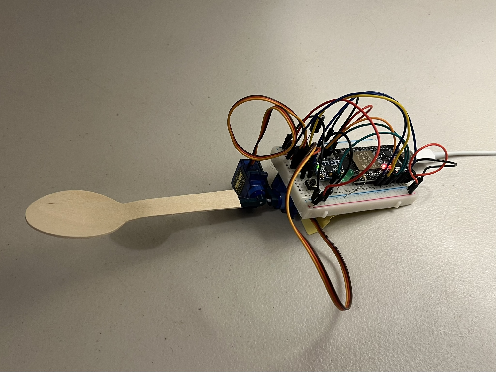
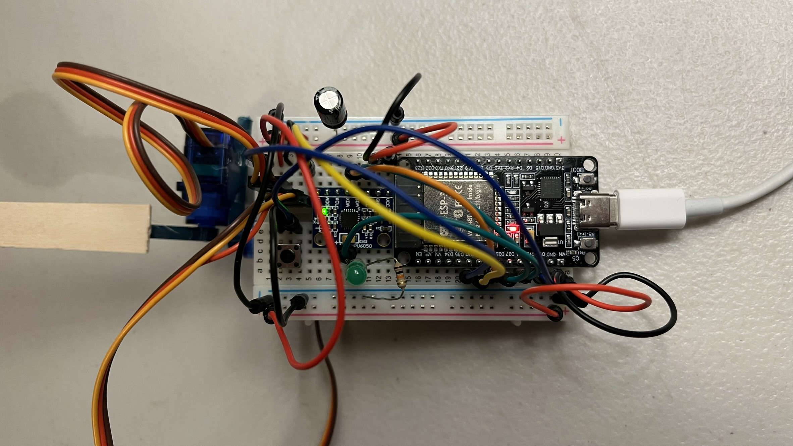
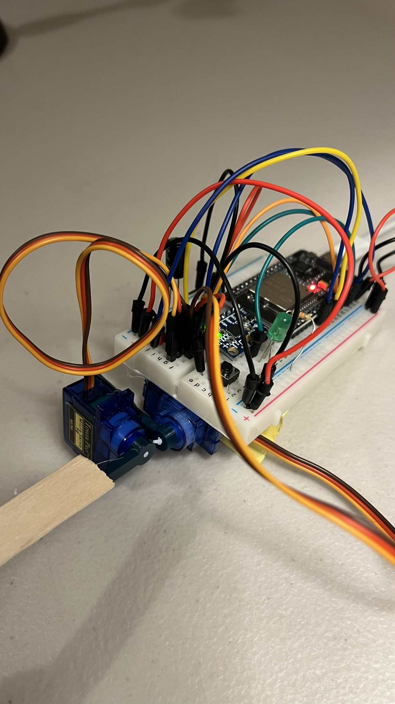

# ESP32 Stabilised Spoon for Parkinson's Disease

An ESP32-based self-levelling spoon that counteracts hand tremor (Parkinson's / essential tremor) using IMU sensor fusion and two servos correcting roll and pitch in real time.

**Prototype only, not a certified or clinically validated assistive device.**

## Why

Involuntary hand shaking from Parkinson's disease or essential tremor can make eating unassisted difficult. Stabilising utensils already exist for this. This project isn't a new invention, just an exercise in how quickly a working prototype could be built from parts already on hand.

## Overview

The ESP32 reads acceleration and angular rate from an MPU6050 over I2C and fuses them with a complementary filter to get a stable roll/pitch estimate that isn't corrupted by either accelerometer vibration noise or gyro drift. Two servos, one per axis, are driven to counter whatever tilt is measured, holding the spoon head level while a button is held down. On boot, the filter zeroes itself against about a second of assumed-level readings, correcting for whatever angle the sensor happens to be mounted at.



Full build: ESP32 and MPU6050 on the breadboard, two MG90 servos stacked for roll and pitch, wooden spoon hot glued to the top servo horn, powered over USB-C.



Wiring close-up: MPU6050 bottom left, pushbutton and LED/resistor along the front row, servo signal lines running to D32/D33, 470µF bulk capacitor across the servo power rail.



The two-servo stack that provides roll and pitch, during range-of-motion testing before the spoon was mounted.

A demo video is available at [`media/spoonvid.mp4`](media/spoonvid.mp4): scooping rice with levelling off spills it immediately; holding the button turns the LED on and keeps the head level while the handle is waved around; letting go turns the LED off, and one tilt sends the rice everywhere.

## Hardware

| Part | Notes |
|---|---|
| ESP32 DOIT DevKit V1 | 30-pin, left-column pins used |
| MPU6050 breakout (GY-521) | I2C accelerometer + gyro, onboard regulator, powered from VIN |
| Servo x2 | MG90 metal-gear; SG90 plastic-gear is a drop-in substitute (same footprint/PWM/voltage, less durable under sustained cycling) |
| Pushbutton | Gates levelling on/off |
| LED + 220Ω resistor | Mirrors button state |
| Breadboard + jumper wires | |
| Wooden spoon | Hot glued to the top servo horn |
| 470µF electrolytic capacitor | Bulk capacitor across the servo power rail |

## Pin assignments

| Function | GPIO |
|---|---|
| MPU6050 SDA | 25 |
| MPU6050 SCL | 26 |
| Servo 1 signal (roll) | 32 |
| Servo 2 signal (pitch) | 33 |
| Button | 13 |
| LED | 14 |

## Wiring notes

- VIN (5V) feeds MPU6050 VCC and both servo red wires; all grounds share one rail
- `D34`/`D35`/`VP`/`VN` on this pin column are input-only and can't drive a servo or LED
- `D12` is a boot-strapping pin and is deliberately left unused
- The MPU6050 runs off VIN rather than 3.3V, since the GY-521 board has its own onboard regulator tolerant of 3–5V input
- A 470µF electrolytic capacitor sits across the servo power rail (VIN/GND) to absorb current spikes from the servos

## Firmware

Built on `MPU6050` (Electronic Cats / jrowberg I2Cdevlib) for sensor access and `ESP32Servo` (Kevin Harrington) for servo PWM, since the standard `Servo` library doesn't work reliably with the ESP32's PWM peripheral.

### Sensor fusion and levelling loop

Boot-time calibration averages 200 accelerometer samples (~1s), assuming the spoon starts level, and stores the result as a per-axis offset:

```cpp
rollOffset  = atan2(ay, az) * 180.0 / PI;
pitchOffset = atan2(-ax, sqrt(ay * ay + az * az)) * 180.0 / PI;
```

Every loop iteration, a complementary filter blends the accelerometer's absolute (but noisy) angle with the gyro's integrated rate (smooth, but drifts over time):

```cpp
const float ALPHA = 0.98;
angleRoll  = ALPHA * (angleRoll  + gyroRollRate  * dt) + (1 - ALPHA) * accRoll;
anglePitch = ALPHA * (anglePitch + gyroPitchRate * dt) + (1 - ALPHA) * accPitch;
```

At `ALPHA = 0.98`, the filter trusts the integrated gyro for 98% of each update, so vibration on the accelerometer doesn't reach the output. It leaks in 2% of the accelerometer's reading each cycle to pull long-term drift back toward the true angle.

The corrected angle (filter output minus the boot-time offset) is constrained and applied against the servo's centre position, so the servos actively counter whatever tilt is measured:

```cpp
int rollCmd  = SERVO_CENTER - constrain((int)correctedRoll,  -SERVO_MAX_DEFLECTION, SERVO_MAX_DEFLECTION);
int pitchCmd = SERVO_CENTER + constrain((int)correctedPitch, -SERVO_MAX_DEFLECTION, SERVO_MAX_DEFLECTION);
```

This only runs while the button is held; releasing it returns both servos to centre and turns the LED off.

Full sketch: [`esp32_stabilised_spoon/esp32_stabilised_spoon.ino`](esp32_stabilised_spoon/esp32_stabilised_spoon.ino).

## Limitations

- MG90/SG90 servos have a slew rate of roughly 60° per 0.1s. Essential tremor runs at roughly 4–12 Hz and Parkinsonian tremor at roughly 4–6 Hz, so at the faster end the servos likely can't fully track the tremor itself. This validates the sensing and control loop rather than proving clinical-grade tremor cancellation.
- The ESP32 and both servos share one 5V rail. A 470µF bulk capacitor across the servo supply mitigates brownout resets from servo current spikes, but separate regulation would still be needed before running off a battery.
